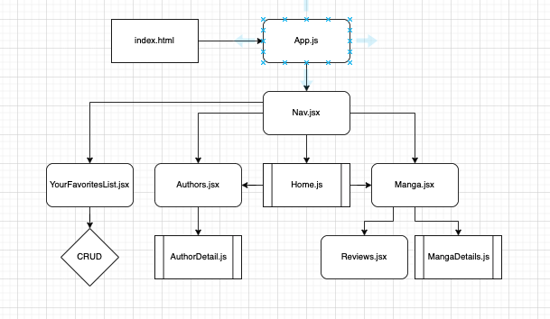
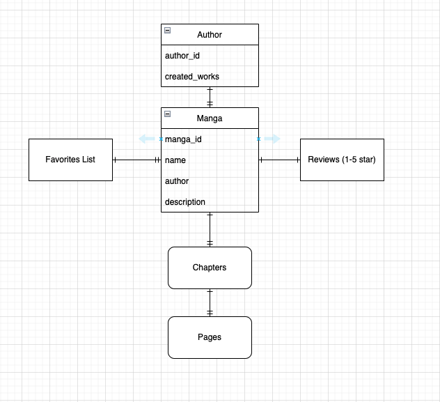

# WeebManga

A manga reading application

### Date: 7/25/2022

#### By: Matthew Scott

#### [Trello](https://trello.com/invite/b/5XP1tWL6/04e96875c73c681c73b668404050382f/weebmanga) | [LinkedIn](https://www.linkedin.com/in/matthew-scott95/) | [GitHub](https://github.com/gr8tscott)

---

### **_Description_**

#### WeebManga is an application you can use to browse and read your favorite manga by your favorite authors.

<!-- #### This was a project I made in less than a week after just learning about HTML, JavaScript, and CSS. -->

---

### **_Component Heirarchy and ERD_**

---

### **_Getting Started_**

#####

##### You can check out the project [here]() on surge.

---

### **_Technologies Used_**

#####

---

### **_Screenshots_**

<!--  -->

---

### **_Future Updates_**

- [] Add author bios and link to manga written
- [] Connect to a manga API
- [] Add anime watching option
- []

### **_Credits_**

#####
